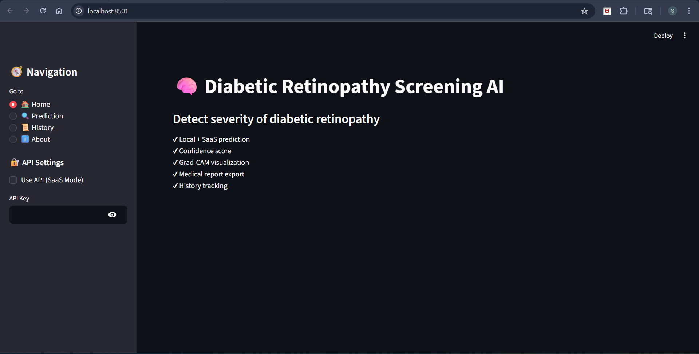
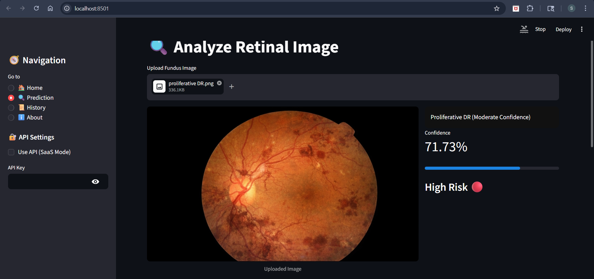
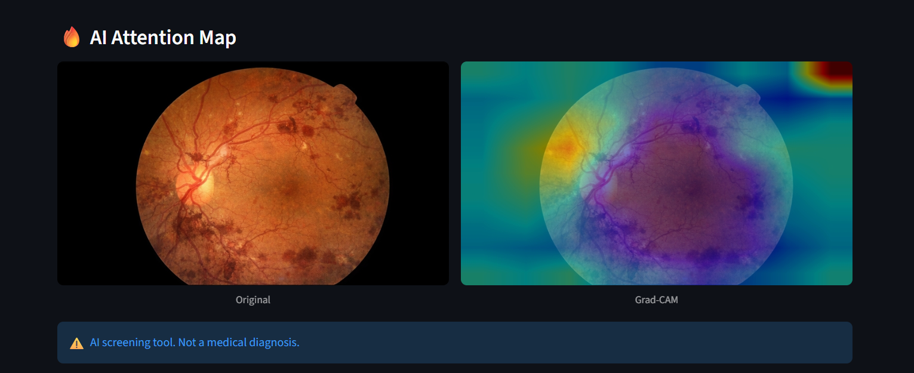
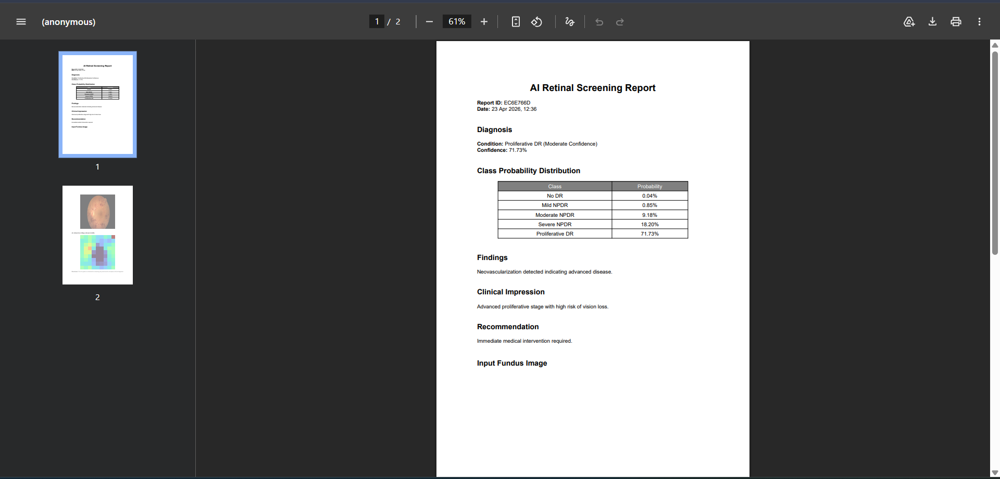
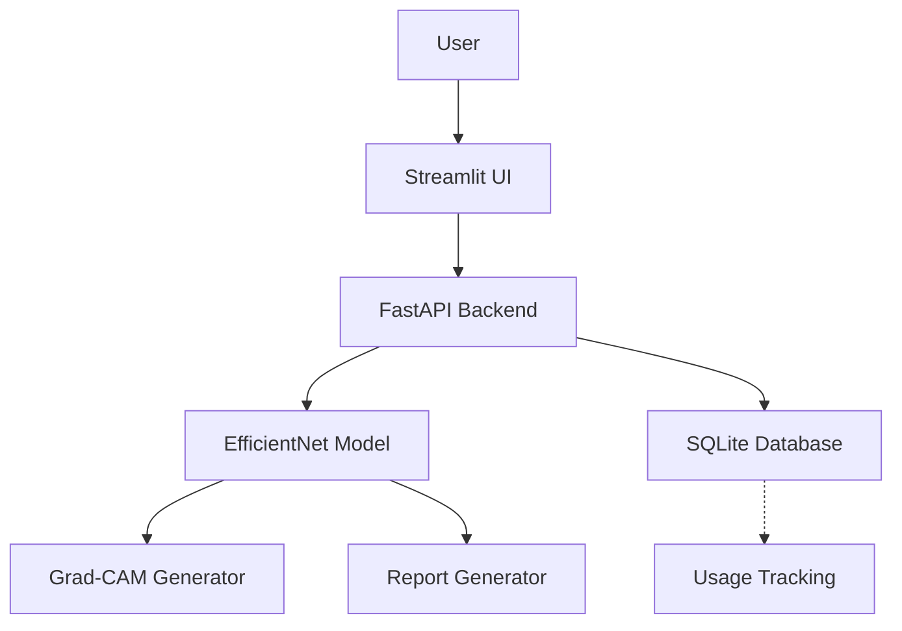

# Diabetic Retinopathy AI Screening System

**Automated detection of diabetic retinopathy from retinal fundus images with explainable AI and production-ready clinical deployment.**

Diabetic retinopathy affects millions globally and early detection is critical for preventing vision loss. This end-to-end system automates screening with a 85% accuracy EfficientNet model, provides transparent predictions via Grad-CAM, and generates clinical-grade PDF reports—enabling healthcare providers to scale retinal disease detection efficiently and reliably.

## Quick Demo

| Interface | Prediction | Explainability | Report |
|:---:|:---:|:---:|:---:|
|  |  |  |  |
| *Home Interface* | *Prediction Output* | *Grad-CAM Heatmap* | *Clinical Report* |

See probability distribution and detailed analytics in the dashboard.

## Why This Project Stands Out

- **Explainable AI in Healthcare**: Grad-CAM visualizations make predictions transparent and trustworthy for medical professionals
- **Production-Ready Architecture**: FastAPI backend with authentication, usage tracking, and scalable design
- **Complete Clinical Pipeline**: From patient image upload to automated PDF report generation
- **Robust Performance**: 85.14% accuracy with calibrated probabilities and Test-Time Augmentation across 5 severity classes

## Key Features

**Classification & Detection**
- 5-class retinopathy severity classification (No DR → Proliferative DR)
- Calibrated confidence scoring with probability distributions
- Test-Time Augmentation (TTA) for enhanced prediction reliability

**Explainability & Clinical Reporting**
- Grad-CAM heatmaps highlighting diagnostic regions
- AI-generated clinical PDF reports with diagnosis summaries
- Transparent decision-making for medical workflows

**Deployment & API**
- FastAPI backend with JWT authentication
- Real-time usage analytics via SQLite
- SaaS-ready infrastructure with API key management
- Streamlit interface for interactive demonstrations

## Technology Stack

**Deep Learning & ML**
- TensorFlow / Keras — Deep learning framework
- EfficientNet — Pre-trained convolutional neural network
- OpenCV — Image processing and augmentation
- NumPy, Pandas — Data manipulation and analysis
- Scikit-learn — Evaluation metrics and preprocessing

**Web & API**
- FastAPI — High-performance backend API
- Streamlit — Interactive frontend interface
- Pydantic — Data validation

**Database & DevOps**
- SQLite — Lightweight usage tracking
- Docker — Containerization for consistent deployment

## System Architecture



**Data Flow:**
1. User uploads retinal fundus image via Streamlit interface
2. FastAPI backend validates and preprocesses the image
3. EfficientNet model predicts disease class with confidence scores
4. Grad-CAM generates attention heatmaps highlighting diagnostic regions
5. Report generator creates clinical PDF with findings
6. Results returned to frontend and logged to database

## Model Performance

The EfficientNet model achieves **85.14% overall accuracy** on the APTOS 2019 dataset with strong performance across severity levels. Test-Time Augmentation and probability calibration ensure robust, reliable predictions in clinical settings.

**Performance Summary**

| Class | Precision | Recall | F1-Score | Support |
|---|---|---|---|---|
| No DR | 0.9493 | 0.9850 | 0.9668 | 1,805 |
| Mild NPDR | 0.7607 | 0.5757 | 0.6554 | 370 |
| Moderate NPDR | 0.7672 | 0.8709 | 0.8158 | 999 |
| Severe NPDR | 0.6531 | 0.4974 | 0.5647 | 193 |
| Proliferative DR | 0.7061 | 0.5458 | 0.6157 | 295 |

**Aggregated Metrics**
- **Overall Accuracy**: 85.14%
- **Macro Average** — Precision: 0.7673 | Recall: 0.6950 | F1: 0.7237
- **Weighted Average** — Precision: 0.8454 | Recall: 0.8514 | F1: 0.8447

**Key Observations**
- Excellent performance detecting healthy retinas (No DR: 96.68% F1), critical for screening
- Strong recall on moderate cases (87.09%), ensuring disease progression is not missed
- Calibrated uncertainty quantification supports clinician confidence in borderline cases

## Getting Started

### Prerequisites
- Python 3.8+
- Git
- Virtual environment manager (venv)

### Installation

**1. Clone the repository**
```bash
git clone https://github.com/Shivam326804/retinal-disease-classifier.git
cd retinal-disease-classifier
```

**2. Create and activate virtual environment**
```bash
python -m venv venv
venv\Scripts\activate  # Windows
# source venv/bin/activate  # macOS/Linux
```

**3. Install dependencies**
```bash
pip install -r requirements.txt
```

### Running the Application

**Option A: Interactive Streamlit Interface**
```bash
streamlit run streamlit_app/app.py
```
Launches the UI at `http://localhost:8501` for interactive predictions and PDF report generation.

**Option B: FastAPI Backend Only**
```bash
uvicorn src.api.main:app --reload --host 0.0.0.0 --port 8000
```
Starts the API server at `http://localhost:8000`. Use `/docs` for interactive API documentation.

**Option C: Docker Deployment**
```bash
docker build -f docker/Dockerfile -t retinal-classifier .
docker run -p 8000:8000 -p 8501:8501 retinal-classifier
```

## Usage Guide

### Local Predictions
1. Launch the Streamlit app
2. Upload a retinal fundus image
3. View predictions, confidence scores, and probability distributions
4. Inspect Grad-CAM visualizations to understand model reasoning
5. Generate and download clinical PDF reports

### API Mode
Use FastAPI backend for programmatic access:

```bash
# Enable API mode in Streamlit sidebar, provide API key
# Or make direct HTTP requests to FastAPI

# Example: Get prediction
curl -X POST "http://localhost:8000/predict" \
  -H "Authorization: Bearer YOUR_API_KEY" \
  -F "file=@retinal_image.jpg"
```

### Generate Clinical Report
In the Streamlit interface, click **"Generate Hospital Report"** to download a PDF with diagnosis summary, confidence scores, and Grad-CAM heatmaps (when available).

## API Reference

| Endpoint | Method | Purpose |
|---|---|---|
| `/login` | POST | Authenticate and obtain API key |
| `/health-check` | GET | Verify service health and status |
| `/usage` | GET | Retrieve API usage statistics |
| `/predict` | POST | Upload image and get prediction |
| `/predict-with-gradcam` | POST | Get prediction with Grad-CAM visualization |

**Full API documentation** available at `/docs` when running the FastAPI server.

## Project Structure

```
retinal_disease_classifier/
├── assets/                 # UI screenshots and assets
├── data/
│   ├── raw/                # Original APTOS 2019 dataset
│   └── processed/          # Preprocessed images and labels
├── models/                 # Trained EfficientNet checkpoint
├── reports/                # Evaluation results and confusion matrices
├── src/
│   ├── api/                # FastAPI backend (authentication, predictions)
│   ├── inference/          # Model inference and Grad-CAM generation
│   ├── preprocessing/      # Data loading and augmentation
│   ├── reports/            # Clinical PDF report generation
│   ├── training/           # Model training and evaluation
│   └── utils/              # Configuration and logging
├── streamlit_app/          # Streamlit web interface
├── tests/                  # Unit and integration tests
├── docker/                 # Dockerfile for containerization
├── logs/                   # Training history and TensorBoard events
└── README.md
```

## Future Roadmap

- Model optimization for edge deployment and real-time processing
- Cloud deployment (AWS/GCP) with auto-scaling
- Electronic Health Records (EHR) system integration
- Clinical validation and regulatory compliance (FDA, CE)
- Multi-modal analysis with OCT and fundus images

## Disclaimer

This system is designed for research and screening support only and is **not a substitute for professional medical diagnosis**. Always consult qualified healthcare professionals for clinical decisions and treatment planning. The developers assume no liability for clinical outcomes.
