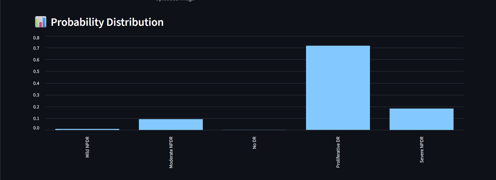
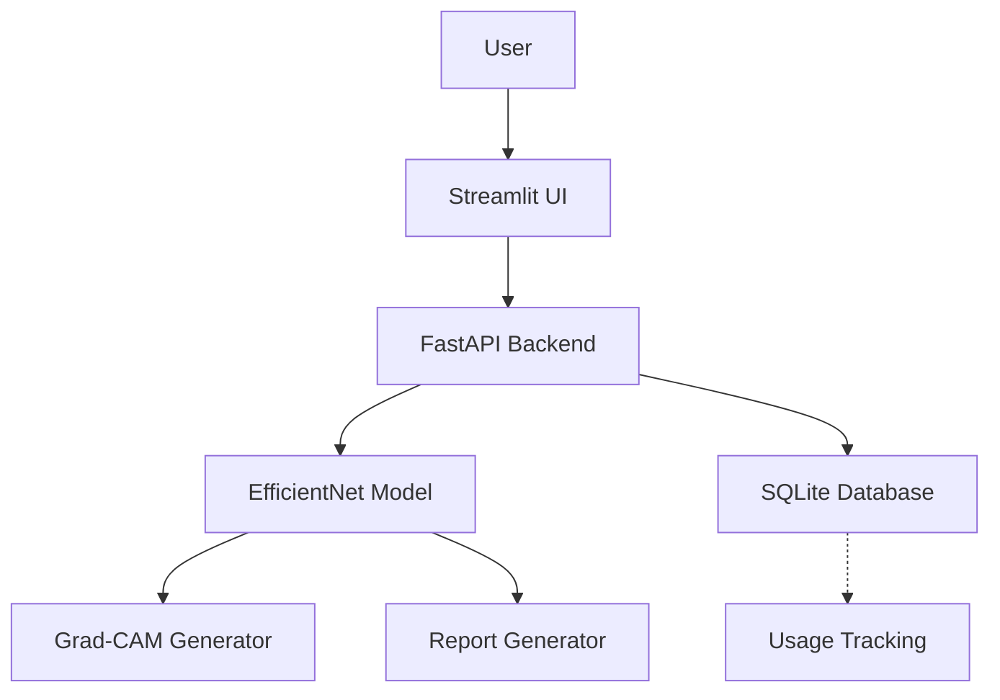

# AI-Based Diabetic Retinopathy Screening System

A comprehensive AI-powered solution for automated screening of diabetic retinopathy using retinal fundus images. This system combines deep learning classification with explainable AI, medical report generation, and a production-ready API for clinical deployment.

## Demo / Screenshots

### Home UI


### Prediction UI


### Probability Distribution


### Grad-CAM Visualization


### Medical Report


## Project Highlights

- **Explainable AI**: Integrated Grad-CAM for transparent model decisions
- **End-to-End Pipeline**: From image upload to automated PDF reports
- **SaaS-Ready Backend**: FastAPI with authentication and usage tracking
- **Automated Reporting**: Clinical-style PDF generation for medical workflows

## Features

- Retinal disease classification across 5 severity classes (No DR, Mild NPDR, Moderate NPDR, Severe NPDR, Proliferative DR)
- Confidence scoring with calibrated probabilities
- Test-Time Augmentation (TTA) for robust predictions
- Grad-CAM heatmaps for model interpretability
- AI-generated medical reports in PDF format
- SaaS API mode with API key authentication
- Usage tracking via SQLite database

## Architecture



## Model Performance

The model achieves strong performance on diabetic retinopathy classification, with particular strength in detecting no disease and moderate cases. Test-Time Augmentation and probability calibration enhance reliability across all severity levels.

### Confusion Matrix


### Classification Report

| Class              | Precision | Recall | F1-Score | Support |
|--------------------|-----------|--------|----------|---------|
| No DR             | 0.9493   | 0.9850 | 0.9668  | 1805   |
| Mild NPDR         | 0.7607   | 0.5757 | 0.6554  | 370    |
| Moderate NPDR     | 0.7672   | 0.8709 | 0.8158  | 999    |
| Severe NPDR       | 0.6531   | 0.4974 | 0.5647  | 193    |
| Proliferative DR  | 0.7061   | 0.5458 | 0.6157  | 295    |

**Overall Accuracy**: 85.14%  
**Macro Average**: Precision: 0.7673, Recall: 0.6950, F1-Score: 0.7237  
**Weighted Average**: Precision: 0.8454, Recall: 0.8514, F1-Score: 0.8447

## How to Run

### Clone Repository
```bash
git clone https://github.com/Shivam326804/retinal-disease-classifier.git
cd retinal-disease-classifier
```

### Install Dependencies
```bash
python -m venv venv
venv\Scripts\activate
pip install -r requirements.txt
```

### Run Frontend
```bash
streamlit run streamlit_app/app.py
```

### Run Backend
```bash
uvicorn src.api.main:app --reload --host 0.0.0.0 --port 8000
```

## Folder Structure

```
retinal_disease_classifier/
├── assets/                 # UI screenshots and assets
├── data/                   # Raw and processed datasets
├── models/                 # Trained model checkpoints
├── reports/                # Evaluation reports and confusion matrices
├── src/                    # Source code
│   ├── api/                # FastAPI backend
│   ├── inference/          # Prediction and Grad-CAM logic
│   ├── reports/            # PDF report generation
│   └── utils/              # Configuration and utilities
├── streamlit_app/          # Streamlit frontend
├── tests/                  # Unit tests
├── docker/                 # Docker configuration
└── README.md
```

## Future Improvements

- Model optimization for edge devices and real-time processing
- Cloud deployment with containerization and scaling
- Integration with electronic health records (EHR) systems
- Clinical validation studies and regulatory compliance

## Usage

### Local Prediction
Upload an image in the Streamlit interface to view predictions, confidence scores, probability distributions, and Grad-CAM overlays.

### API SaaS Mode
Enable API mode in the Streamlit sidebar, provide an API key, and run predictions through the FastAPI backend.

### Generate PDF Report
Click "Generate Hospital Report" in the Streamlit app to download a clinical PDF with diagnosis summary, images, and Grad-CAM if available.

## API Endpoints

- `POST /login`: Authenticate and get API key
- `GET /health-check`: Check service status
- `GET /usage`: View API usage statistics
- `POST /predict`: Upload image and get prediction
- `POST /predict-with-gradcam`: Get prediction with Grad-CAM visualization

## Notes

This system is for screening and research purposes only. It is not a substitute for professional medical diagnosis. Always consult healthcare professionals for clinical decisions.
