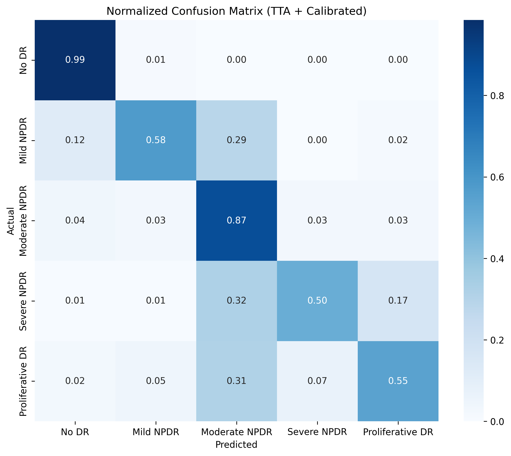

# AI Retinal Disease Classifier

A full-stack system for automated **Diabetic Retinopathy** screening using retinal fundus images. The project combines a transfer-learned EfficientNetB3 classifier with a production-style FastAPI backend, a Streamlit frontend, Grad-CAM explainability, and PDF medical report generation.

## 🚀 Overview

This repository implements a practical clinical screening pipeline for Diabetic Retinopathy severity classification using:

- **EfficientNetB3** with transfer learning
- **260×260** fundus image input
- **5 disease severity classes**
- **CLAHE preprocessing**
- **Test-Time Augmentation (TTA)**
- **Probability calibration**
- **Grad-CAM explainability**
- **FastAPI backend with SQLite usage tracking**
- **Streamlit frontend for local and API-driven prediction**
- **PDF medical report generation**

## ✨ Key Features

- Retinal image preprocessing with **CLAHE** and EfficientNet standard normalization
- **EfficientNetB3** inference with a custom classifier head
- **5-target classification**: No DR, Mild NPDR, Moderate NPDR, Severe NPDR, Proliferative DR
- **TTA ensemble** for robust prediction across flipped, rotated, and brightness-adjusted variants
- **Probability calibration** to improve severity attribution
- **Grad-CAM heatmaps** for model interpretability
- FastAPI SaaS-ready backend with **API key authentication**
- **SQLite usage tracking** for API requests
- Streamlit UI with image upload, prediction visualization, Grad-CAM view, and **hospital-style PDF report export**

## 🧩 System Architecture

```
User Image Upload
        │
        ▼
 Streamlit App ───────────────┐
        │                      │
        ▼                      │
   Predictor / Local Model     │
        │                      │
        ▼                      │
   CLAHE → Resize → Normalize  │
        │                      │
        ▼                      │
   TTA → Model Ensemble        │
        │                      │
        ▼                      │
   Calibrated Probabilities   │
        │                      │
        ▼                      │
   Prediction + Grad-CAM       │
        │                      │
        ▼                      │
   PDF Medical Report Export   │

Optional SaaS Mode → FastAPI Backend → SQLite Usage DB
```

## 📦 Installation

### Local Setup

```bash
git clone https://github.com/Shivam326804/retinal-disease-classifier.git
cd retinal-disease-classifier
python -m venv venv
venv\Scripts\activate
pip install -r requirements.txt
```

### Model and Data

- Ensure `models/final_model.keras` exists before inference.
- Raw dataset should be placed under `data/raw/APTOS_2019/`.
- Processed arrays are stored in `data/processed/` after preprocessing.

## ▶️ Running the Backend

### Start FastAPI

```bash
uvicorn src.api.main:app --reload --host 0.0.0.0 --port 8000
```

### Or run directly

```bash
python -m src.api.main
```

## ▶️ Running the Streamlit Frontend

```bash
streamlit run streamlit_app/app.py
```

## 🧪 Usage

### Local prediction

Upload an image in the Streamlit interface and view the predicted DR severity, confidence score, probability distribution, and Grad-CAM overlay.

### API SaaS mode

1. Enable **Use API (SaaS Mode)** in the Streamlit sidebar
2. Provide a valid `x-api-key`
3. Upload an image and run prediction through the FastAPI backend

### Generate PDF report

From the Streamlit app, click **Generate Hospital Report** to download a clinical-style PDF containing:

- Prediction summary
- Confidence score
- Class probabilities
- Input fundus image
- Optional Grad-CAM attention map

## 🧠 API Endpoints

### `POST /login`
- Request: `username`, `password`
- Response: `api_key`

### `GET /health-check`
- Response: service status and model load state

### `GET /usage`
- Header: `x-api-key`
- Response: total requests, successful requests, failed requests

### `POST /predict`
- Header: `x-api-key`
- Multipart: `file` image upload
- Response: predicted disease, confidence, probabilities, Grad-CAM availability

### `POST /predict-with-gradcam`
- Header: `x-api-key`
- Multipart: `file` image upload
- Response: predicted disease, confidence, probabilities, optional Grad-CAM image

## 🔍 Grad-CAM Explainability

The project uses Grad-CAM to generate a heatmap over the retinal image, highlighting regions that contributed most to the model's classification decision. Grad-CAM is available in local Streamlit mode and the `/predict-with-gradcam` API endpoint when the model architecture supports it.

## 🩺 Medical Report Feature

A hospital-style PDF report is generated using `reportlab`.
The report includes:

- DR diagnosis summary
- Confidence score
- Class probability table
- Input image
- Optional Grad-CAM attention map

## 📊 Model Performance



- **Accuracy**: ~85%
- **Class imbalance** is present across the 5 DR severity labels
- **Test-Time Augmentation + probability calibration** improve the prediction stability for severe classes

## 📁 Project Structure

- `src/api/main.py` — FastAPI application with authentication and request logging
- `src/inference/predictor.py` — EfficientNetB3 inference, CLAHE, TTA, and calibration
- `src/inference/grad_cam.py` — Grad-CAM heatmap generation
- `src/reports/medical_report.py` — PDF report generation
- `src/utils/config.py` — central application configuration
- `streamlit_app/app.py` — Streamlit frontend
- `models/final_model.keras` — trained model checkpoint
- `data/raw/APTOS_2019/` — raw dataset files
- `data/processed/` — processed images and labels

## 📌 Notes

- The system is intended for **screening and research** only.
- It is not a substitute for clinical diagnosis.

## 🤝 Contributing

Contributions are welcome. Please open a pull request with bug fixes, enhancements, or documentation improvements.
